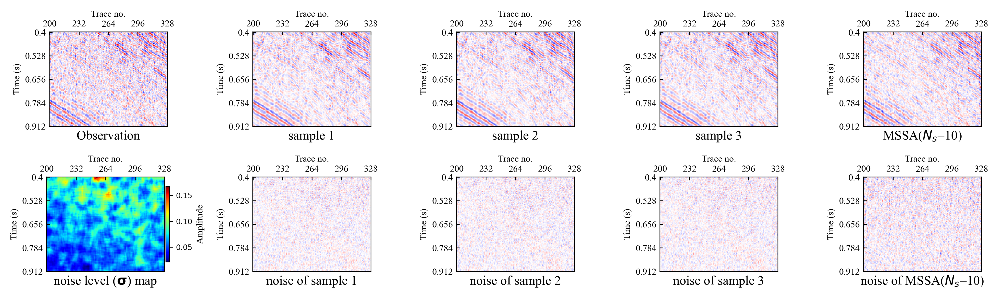
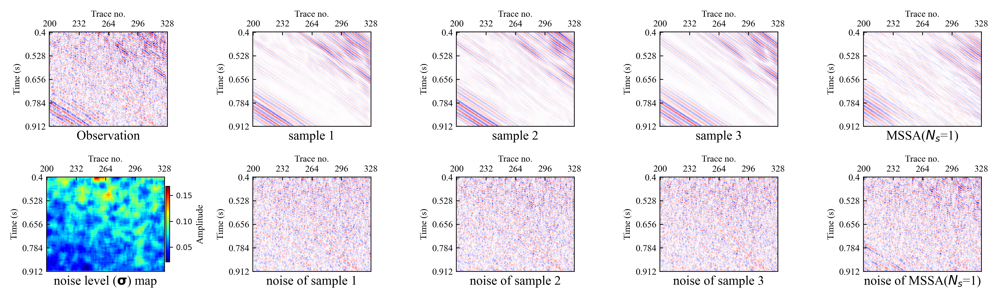
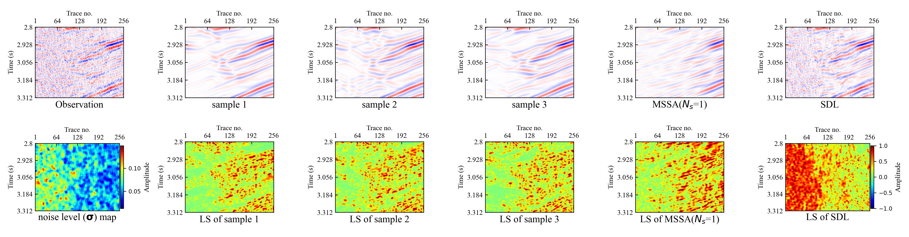

# Interactive Posterior Sampling for Random Noise Attenuation 
This repo contains the official implementation for the paper [Posterior Sampling for Random Noise Attenuation via Score-based Generative Models
](https://library.seg.org/doi/10.1190/geo2024-0186.1). 

by Chuangji Meng, Jinghuai Gao, Baohai Wu, Hongling Chen, and Yajun Tian

This is an example of schematic diagram of conditional posterior sampling.


## Running Experiments

### Dependencies

Run the following conda line to install all necessary python packages for our code and set up the environment.

```bash
conda env create -f environment.yml
```

The environment includes `cudatoolkit=11.0`. You may change that depending on your hardware.

### Project structure

`main.py` is the file that you should run for both training and sampling. Execute ```python main.py --help``` to get its usage description:

```
usage: main.py [-h] --config CONFIG [--seed SEED] [--exp EXP] --doc DOC
               [--comment COMMENT] [--verbose VERBOSE] [-i IMAGE_FOLDER]
               [-n NUM_VARIATIONS] [-s SIGMA_0] [--degradation DEGRADATION]

optional arguments:
  -h, --help            show this help message and exit
  --config CONFIG       Path to the config file
  --seed SEED           Random seed
  --exp EXP             Path for saving running related data.
  --doc DOC             A string for documentation purpose. Will be the name
                        of the log folder.
  --comment COMMENT     A string for experiment comment
  --verbose VERBOSE     Verbose level: info | debug | warning | critical
  -i IMAGE_FOLDER, --image_folder IMAGE_FOLDER
                        The folder name of samples
  -n NUM_VARIATIONS, --num_variations NUM_VARIATIONS
                        Number of variations to produce
  -s SIGMA_0, --sigma_0 SIGMA_0
                        Noise std to add to observation
  --degradation DEGRADATION
                        Degradation: rec | den 
                        

```

Configuration files are in `config/`. You don't need to include the prefix `config/` when specifying  `--config` . All files generated when running the code is under the directory specified by `--exp`. They are structured as:

```bash
<exp> # a folder named by the argument `--exp` given to main.py
├── image_samples 
│  
├── logs # contains checkpoints and samples produced during training
│   └── <doc> # a folder named by the argument `--doc` specified to main.py
│      └── checkpoint_x.pth # the checkpoint file saved at the x-th training iteration
├── image_samples # contains generated samples
│   └── <i>
│       ├── stochastic_variation.png # samples generated from checkpoint_x.pth, including original, degraded, mean, and std   
│       ├── results.mat # the pytorch tensor corresponding to stochastic_variation.png
│       └── y_0.mat # the pytorch tensor containing the input y of SNIPS
```

### data preparation/ Downloading data
You can test on Marmousi (mat file format)/ [Opensegy]("http://s3.amazonaws.com/open.source.geoscience/open_data) (SEGY/SGY file format) / field data (SEGY/SGY file format)
## Interactive Posterior Sampling Example
# Mild suppression mode
This is an example of Mild suppression mode

# Moderate suppression mode
This is an example of Moderate suppression mode

# Strong Suppression Mode
This is an example of Strong Suppression Mode


# Example of diversity of solutions under strong field noise (using Strong Suppression Mode)
This is an example of Strong Suppression Mode



### Running 

If we want to run sampling on marmousi, with added noise of standard deviation 0.1, and obtain 3 variations, we can run the following

```bash
python ncsn_runner_mcj_GT.py -i images --config marmousi.yml --doc marmousi_v2_nm -n 3 --degradation den --sigma_0 0.1
```
Samples will be saved in `<exp>/image_samples/marmousi_v2_nm`.

The available degradations are: Denoising (`den`). The sigma_0 (noise level of observation) can be set manually or estimated automatically.

If you don't need GT to evaluate the results, use main_mcj_sample_noGT.py for synthetic data (e.g., mat foramt file) and main_mcj_sample_noGT_field.py for real data (SEGY/SGY file format).


## Pretrained Checkpoints

We provide two trained models and log files in files `<exp>/logs/marmousi_v2_nm` and `<exp>/logs/MmsSegyopenf`. see [pretrained model](https://pan.baidu.com/s/1p5y_JC1AWSD7QCWRsSwMFw?pwd=1111), 提取码: 1111.

These checkpoint files are provided as-is from the authors of [NCSNv2_seismic](https://github.com/mengchuangji/ncsnv2_seismic).

To **speed up** sampling, we also provide a trained score network implemented with Unet in files `<exp>/logs/MmsSegyopenf_unet` (ckpt_id=220000, 800000); see [pretrained model](https://pan.baidu.com/s/149cJjFPd5PanTVnxIc9pxw?pwd=1111), 提取码: 1111.
; you can run  main_mcj_sample_noGT_field_when_ScoreNetwork_is_unet.py, the config file is `<config>/marmousi_unet.yml`


**Note**:
----------------------------------------------------------------------------------------
You can also retrain a SGMs (change hyperparameters or datasets , see [NCSNv2_seismic](https://github.com/mengchuangji/ncsnv2_seismic)) to get your own generative model for seismic data or other types of natural image data, remote sensing data, medical imaging data.

**Some of the code is for drawing some pictures, if you don't need it, you can comment it out. For example, plot stochastic_variations_R, plot stochastic_variations_LS, plot stochastic_variations_x_t in <runner>/ncsn_runner\_\*.py`**

----------------------------------------------------------------------------------------
**Note**: This project is being integrated into commercial software and is intended for scientific research purposes only, not commercial purposes.
-----------------------------------------------------------------------------------------


## References

If you find the code/idea useful for your research, please consider citing

```bib
Meng, Chuangji, et al. "Posterior Sampling for Random Noise Attenuation via Score-based Generative Models." Geophysics 90.2 (2024): 1-54.
```
and/or our earlier work on simultaneous denoising and noise level estimation

```bib
@ARTICLE{meng2022seismic,
  author={Meng, Chuangji and Gao, Jinghuai and Tian, Yajun and Wang, Zhiqiang},
  journal={IEEE Transactions on Geoscience and Remote Sensing}, 
  title={Seismic Random Noise Attenuation Based on Non-IID Pixel-Wise Gaussian Noise Modeling}, 
  year={2022},
  volume={60},
  number={},
  pages={1-16},
  keywords={Attenuation;Noise measurement;Gaussian noise;Data models;Noise reduction;Noise level;Training;Deep learning (DL);noise estimation;noise modeling;non-independently identically distribution (IID);seismic random noise attenuation (NA);variational inference (VI)},
  doi={10.1109/TGRS.2022.3175535}}
```


